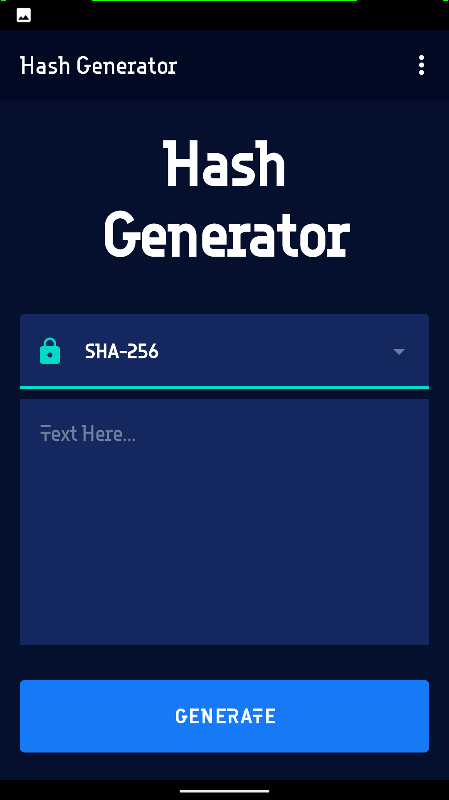
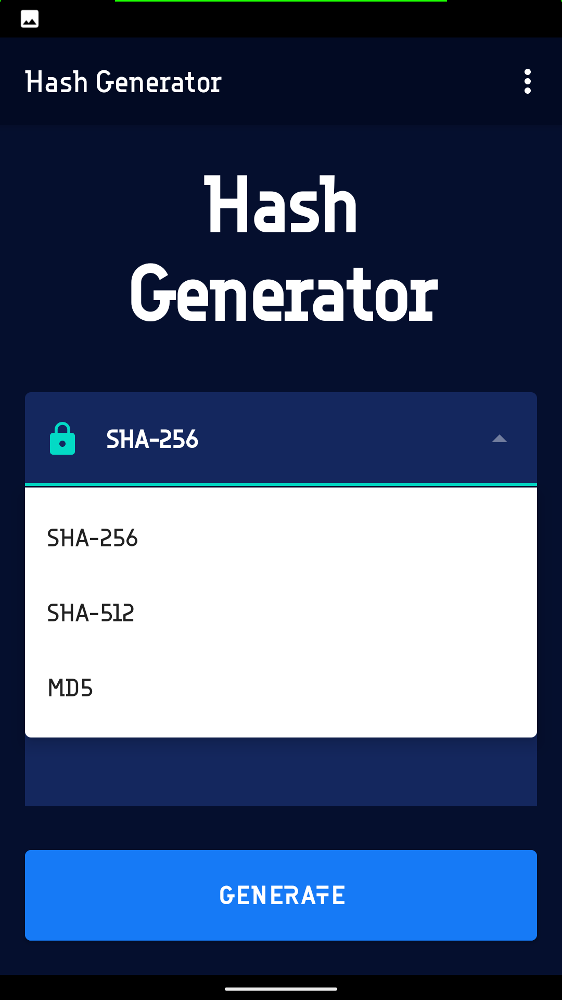
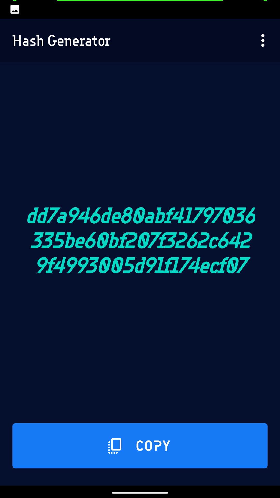

# HashGenerator
An Android app to encrypt any text message using SHA256, SHA512 and MD5 alogirthm.This repository is made for the purpose to showcase my project for learning purposes and should not be used commercially.
I build this application while learning about encryption.

# Features

1. User can choose between different encryption algorithm. for eg SHA256, MD5, SHA512.
2. User can copy the encryted text. 

# Features to be implemented in Future.

1. Decrypt the encrypted text.
2. Add more Encryption Algorithm.
3. Add Password Generator and Password Strength Checker.
4. Add hash type identifier and hash cracker features.
5. Break encrypted messages.

# How to use

1. Enter the text in the input field.
2. Choose algorithm. List of available options 
<ul>
<li>SHA256</li>
<li>SHA512</li>
<li>MD5</li>
</ul>
3. Click generate button to encrypt the text.
4. Copy the encrypted text.

# Examples

1. SHA256: 
<ul>
<li>text -> exp</li>
<li>Encrypted text: dd7a946de80abf41797036335be60bf207f3262c6429f4993005d91f174ecf07</li>
</ul>

2. SHA512: 
<ul>
<li>text -> test</li>
<li>Encrypted text: ee26b0dd4af7e749aa1a8ee3c10ae9923f618980772e473f8819a5d4940e0db27ac185f8a0e1d5f84f88bc887fd67b143732c304cc5fa9ad8e6f57f50028a8ff</li>
</ul>

2. MD5: 
<ul>
<li>text -> test3</li>
<li>Encrypted text: 8ad8757baa8564dc136c1e07507f4a98</li>
</ul>

The app is designed with Google Material Design that supports the Android versions from Kitkat 4.4.0 to Android 11.

# Screenshots

 Main Screen          |  Algorithm list          |  Encrypted text Screen
:--------------------:|:------------------------:|:------------------------:
 |    |   

# I also highly recommend you to suggest some improvements in the project.
